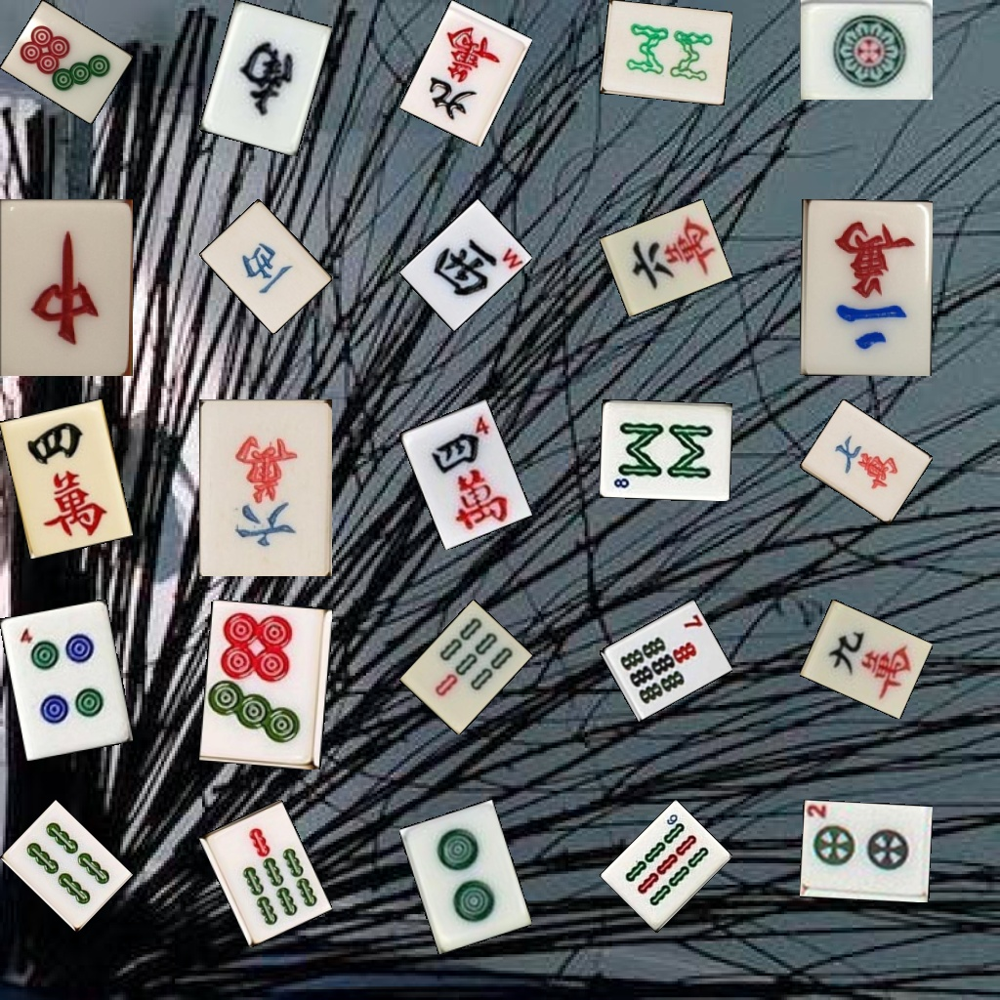

# Mahjong Dataset Augmentation

## Introduction
* The application could generate image datasets of Chinese Mahjong tiles, with tens of thousands of images and annotations.
* The application uses *Python* and *OpenCV* to generates images where rotated mahjong tiles are placed on a random background.

    

## Usage of dataset
* The application would export a csv file that saves the detailed annotation information of the images in the dataset. The csv file is compiled in the format that conforms to the guideline of **AutoML Vision of Google Cloud Platform** ([Link](https://cloud.google.com/vision/automl/object-detection/docs/csv-format)).

* With the csv file, the image dataset could be used to train an object detection model in the **AutoML Vision of Google Cloud Platform**.  The trained object detection model could identify and locate mahjong tiles within a live streaming video.

    

## Credits
* Describable Textures Dataset ([Link](https://www.robots.ox.ac.uk/~vgg/data/dtd/))
* Mahjong Dataset created by *Camerash* ([Link](https://github.com/Camerash/mahjong-dataset))
